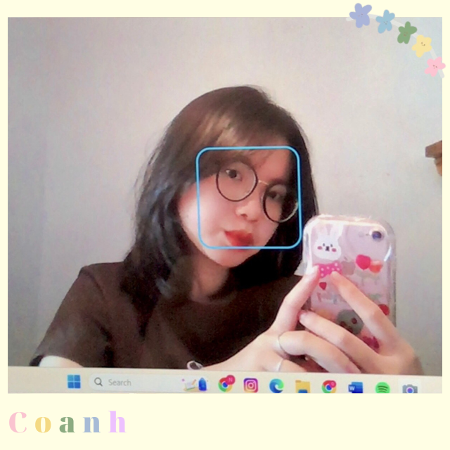
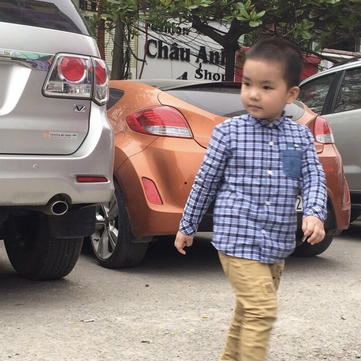
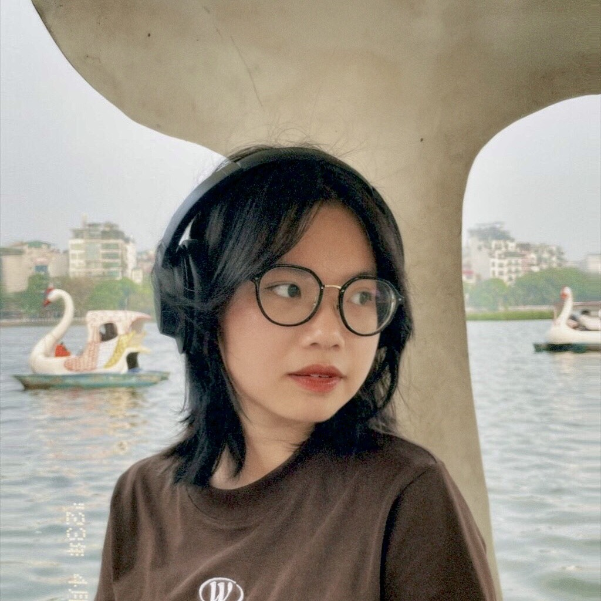

# sample-21080302
<html>
<head>

<body>

<h1 style="color:#824ecc";>Welcome to my self introduction!</h1>

✨ Nguyễn Quỳnh Anh_21080302_MAS1 ✨

    

 
<button style="font-size:1.1rem; align:center; background-color:#f2ebfc;
border:1px;border-radius:10px;"><a href="https://www.facebook.com/profile.php?id=100013270063923">FACEBOOK</a></button>

 

 Xin chào, mình là Nguyễn Quỳnh Anh, thành viên nhóm <b>Ferb - Phineas's friend!</b> 
 Mình là sinh viên năm 2 chuyên ngành Quản trị và An ninh, trường Quản trị và Kinh doanh - ĐHQGHN. 
 <a href ="https://hsb.edu.vn/"> Về trường mình <a/> 
 Và dưới đây là đôi chút về bản thân mình 🥰 
 

<h1 style="color:#874cd4;font-size:25px";>My Family</h1>

<table border="0px"> 
	<tr>
		<td>

</td>
		<td> </td>
		<td> </td>
		<td>

</td>
		<td> </td>
		<td> </td>
		<td>

</td>
		<td> </td>
		<td> </td>
		<td>

</td>
	</tr>
	<tr>
		<th>Bố mình</th>
		<td> </td>
		<td> </td>
		<th>Mẹ mình</th>
		<td> </td>
		<td> </td>
		<th>Em trai mình</th>
		<td> </td>
		<td> </td>
		<th>Và cuối cùng là mình</th>
	</tr>
</table>

<h1 style="color:#874cd4;font-size:25px";>My Hobbies</h1>

<ul>
 <li><b style="color:red;font-size:17px;";>Đọc sách</b>: Mình thích đọc những cuốn sách về văn học, đặc biệt văn học nước ngoài mang lại cho mình rất nhiều cảm xúc sâu sắc. 
 Và dưới đây là một số tác phẩm mình tâm đắc nhất </li>

<table border="0px"> 
	<tr>
		<td>

</td>
		<td> </td>
		<td> </td>
		<td>

</td>
		<td> </td>
		<td> </td>
		<td>

</td>
	</tr>
	<tr>
		<th>Bạn đắt giá bao nhiêu?</th>
		<td> </td>
		<td> </td>
		<th>Harry Potter</th>
		<td> </td>
		<td> </td>
		<th>Cây cam ngọt của tôi</th>
	</tr>
</table>

 <li><b style="color:red;font-size:17px";>Nghe nhạc</b>: Mình nghe nhạc gần như mọi lúc mọi nơi, mình cũng yêu thích rất nhiều thể loại nhạc khác nhau. 
 Một trong những bài hát mà mình yêu thích nhất là <b>"Come and get your love"</b> của <b>Redbone</b> </li>

 <audio controls play-during>
<source src="audio.mp3" type="audio/mp3">
</audio> 

 <li><b style="color:red;font-size:17px";>Xem phim</b>: Mình xem rất nhiều phim nhưng mình vẫn thích nhất là xem những bộ phim mang lại cảm giác "Healing". 
 Và bộ phim mình yêu thích nhất là <b>"Hospital Playlist"</b> </li>

<video width="300" height="300" controls play-during>
<source src="HP.mp4" type="video/mp4">
</video>

 <li><b style="color:red;font-size:17px";>Đặc biệt</b> là được bên cạnh gia đình và bạn bè</li> 

<table border="0px"> 
	<tr>
		<td>

</td>
		<td> </td>
		<td> </td>
		<td>

</td>
		<td> </td>
		<td> </td>
		<td>

</td>
	</tr>
</table>

<table border="0px"> 
	<tr>
		<td>

</td>
		<td> </td>
		<td> </td>
		<td>

</td>
	</tr>
</table>
</ul>

Và đó là phần giới thiệu của mình  
Cảm ơn mọi người đã đón xem! 

 
<h2 style="color:#824ecc";>Liên hệ với mình 📩</h2>

<table bgcolor="#e3dded">
<form>
<tr>
<td>Your Name:</td>
<td> <input type="text" name="name"></td></tr>
<td> </td>
<tr>
<td>Your Email:</td>
<td> <input type="email" name="email"></td></tr>
<td> </td>
<tr>
<td>Comment:</td> 
<td><textarea name="comment"></textarea></td></tr>
<td> </td>
<tr>
<td><input type="submit" name="submit" value="Send"></td>
<td> </td>
</tr>
</form>
</table>

</body>
</html>

